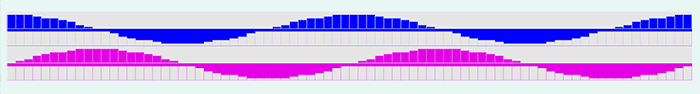

# ansigraph

[](https://travis-ci.org/BlackBrane/ansigraph)
[](http://hackage.haskell.org/package/ansigraph)
[](http://stackage.org/nightly/package/ansigraph)


__Terminal-based graphing via ANSI and Unicode__



### Overview

Ansigraph is an ultralightweight terminal-based graphing utility. It uses Unicode characters and ANSI escape codes to display and animate colored graphs of vectors/functions in real and complex variables.

Specifically we use the Unicode characters `▁▂▃▄▅▆▇█` which allow for graphing of quantities in units of 1/8. By utilizing ANSI SGR coloring codes, we can also include a region for negative values by using the same characters and swapping the foreground and background colors. There's also functionality for displaying matrices via the "density"-like characters `░▒▓█`. Both kinds of graphs have complex number versions, which show real and imaginary components separately with distinct colors.

In all cases the resulting view is necessarily a rough one; the intended role of this library is to provide very easy, low-overhead, "quick and dirty" views of data sets when a more weighty graphing solution would be overkill.

### Usage

This functionality is provided by a `Graphable` type class, whose method `graphWith` draws a graph at the terminal. Another function `animateWith` takes a list of Graphable elements and displays an animation by rendering them in sequence. Both of these functions take an options record as an argument. The `graph` and `animate` functions are defined to use the default options, and the user can define similar functions based on their own settings.

The package is intended to be used in one of two ways.

Importing `System.Console.Ansigraph` provides all the functionality we typically use. This includes the _FlexibleInstances_ extension, which makes it marginally more convenient to use graphing functions by allowing instances like `Graphable [Double]`.

If you want to use the package without activating _FlexibleInstances_ then you can import `System.Console.Ansigraph.Core`, which provides everything except these instances. Then you must use one of a few newtype wrappers, namely: `Graph`, `PosGraph`, `CGraph`, `Mat`, `CMat`. These wrappers are also available from the standard `Ansigraph` module.

Some of these wrappers may be useful even when working from the main module because it indicates a particular kind of graph is to be used. For example, `PosGraph` holds the same kind of data as `Graph` but uses a graph style that assumes its data to be positive. For the same reason it may prove useful to define other wrapper data types when new approaches to terminal graphing are devised.

### Examples

A minimal example would be the following.

```
λ> import System.Console.Ansigraph
λ> let v = [1..30] :: [Double]
λ> graph v
▁▁▁▁▂▂▂▂▃▃▃▃▄▄▄▅▅▅▅▆▆▆▆▇▇▇▇██

```

Notice that the graph is always normalized relative to the maximum value present.
Since in this case our data is strictly-positive, we could have instead opted for the corresponding
positive graph style via `graph (PosGraph v)`, which would generate the same output except the blank
line at the bottom, corresponding to the empty negative region, would be absent.

In the `Examples` module included in the package, we also define a complex exponential wave,
which is depicted at the top of this page. The static version is defined and graphed like this:

```
λ> import Data.Complex
λ> let wave = cis . (*) (pi/20) <$> [0..79] :: [Complex Double]
λ> graph wave
```
To make an animation, we need a list of graphable elements. This one is created by multiplying the wave by _exp(it)_ in some units.

```
λ> let deltas = (*) (-pi/10) <$> [0..50]
λ> let waves = zipWith (\z -> map (* z)) (cis <$> deltas) $ replicate 50 wave
λ> animate waves
```

This produces the animation seen at the top of this page.

### Future work

Some of the type signatures could, and probably should be generalized, in particular to eliminate the need for annotating floating point types at the REPL, like I did above. I also plan to add support for sideways style graphs, like I use in my [probability](https://github.com/BlackBrane/probability) package.

Of course, feedback and pull requests are welcome.
